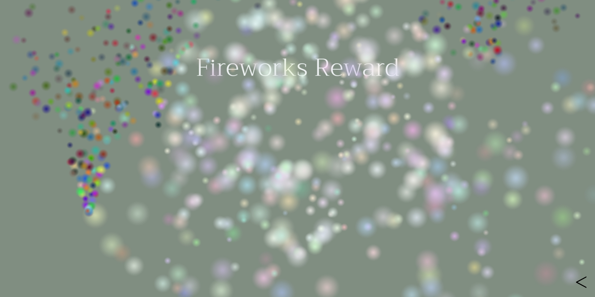

# CompostMaking—teaching challenged kids to create composts through a game app

### About
- **CompostMaking** is an Android game (developed in collaboration with NGO [Tamana organization, New Delhi](http://www.tamana.org/)) designed for challenged kids that teaches them how to create compost using household waste. Developed in C++ with [cocos2dx](https://cocos2d-x.org/) game engine.
- The main goal of the game is to inculcate the skill of differentiation between biodegradable and non-biodegradable items. The game consists of multiple levels (with increasing difficulties) in which the player is supposed to decide whether the displayed object is biodegradable or not. If the displayed item is biodegradable (such as leaves), then the player is supposed to drag-and-drop the object onto a **green tray**; otherwise, if it is non-biodegradable (such as plastic bag), then the player is supposed to drag-and-drop the object onto a **blue tray**. 
- The game is useful for carrying out vocational training of challenged (autistic) kids for this particular **skill of making composts**. It can be used by teachers and trainers to train these special children more efficiently with a fun game-like element to the overall learning process (which may in turn, help increase retention).
- We have incorporated **_following features_** in CompostMaking, specifically keeping in mind that the target audience comprises of a special child (the player/trainee) and a teacher (the trainer):
    1. A **_very simple interface_** has been kept deliberately so that the player has least amount of distraction
    2. An **_in-game character_** has been added whose expressions and sounds provide feedback to the player about his/her progress (simple smiley faces are also used to convey the result of each classification attempt made by player)
    3. After a period of inactivity, the in-game character **_reaches out to the player_** to bring their attention back to the game (special kids tend to lose attention and stop playing the game otherwise)
    4. After each level, **_a reward screen_** has been added in which players can either pop colorful balloons or see colorful fireworks (this is intended to be a reward incentive for players)
    5. **_Statistics_** regarding the gameplay (# of incorrect attempts, etc) are saved into a local database that can be monitored by the trainer inside the application itself (click on bottom-left database button on the homescreen)
    6. **_Hindi_** language support has also been added (go to Settings from homescreen and turn off English)

CompostMaking is developed by **Hasan Kamal of Indraprastha Institute of Information Technology, Delhi (IIIT-D)** in collaboration with **Dr Krishna of Tamana organization, New Delhi** (a non-profit NGO for multiply challenged and autistic individuals).

### Demo
- Click on the image below to watch a video walkthrough on YouTube

### Repository structure
-  `Classes` contains the source code
-  `Resources` contains the assets/resources
    
### Installation
- [APK, 64-bit](https://drive.google.com/open?id=1ycnEQGD6Kvt3XeDcsegQjqftjq9NKdtl) [*FOR MOST DEVICES*]
- [APK, 32-bit](https://drive.google.com/file/d/1mYZSAqpHKHKCfrXFIEFmLO_0cvQkqdp7/view?usp=sharing)
- [APK, x86](https://drive.google.com/file/d/1tBjU3KrGLYP_MbZLvR88zVmAAdhze_u-/view?usp=sharing)

### Screenshots

